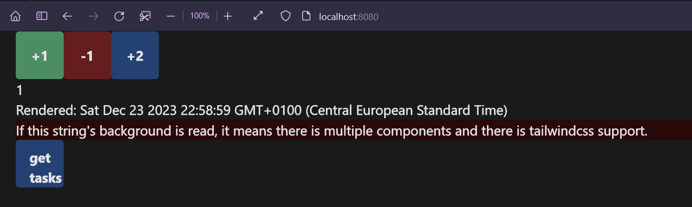
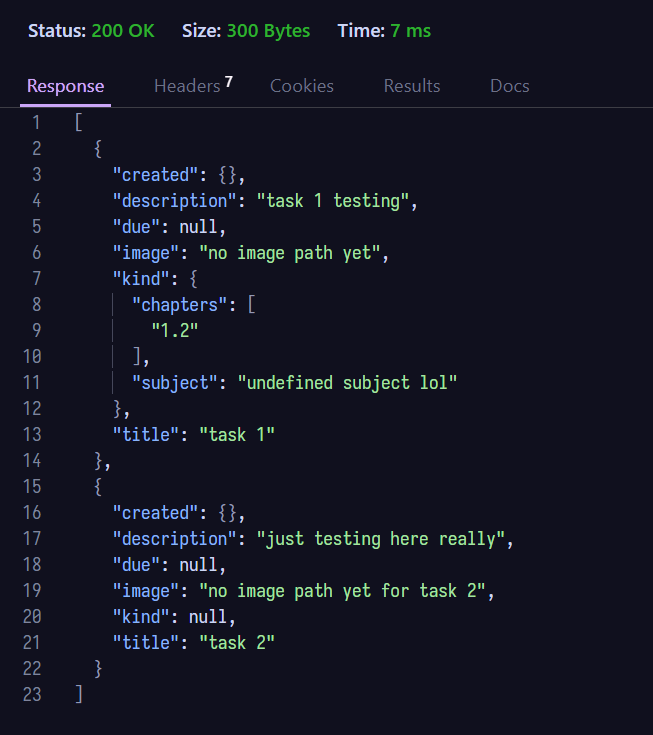

# Rust todo app

## This project is a personal project to create a fully functioning website in Rust using a [Rocket.rs](https://rocket.rs/) backend, with a [Yew.rs](https://yew.rs/) wasm frontend. I'm also planning to add a PostgresDB to the project and splitting the project into seperated docker containers

### Running the code

#### **Locally**

To host the website locally, you will have to perform the following actions, in 2 terminal:

first terminal

```sh
cd app
tailwindcss -i ./css/input.css -o ./css/output.css
trunk build
```

second terminal

```sh
cd server
cargo r 
```

or when using nushell source the build.nu file using:

```sh
source build.nu
```

This will give you access to commands that are just a bit quicker than their verbose counterparts. Additionaly, with the docker support added now, you can run the apps by running:

#### **In docker containers**

```sh
docker-compose up
```

This will create and compile the docker containers and run them. Note that this will take a while since you also have to compile trunk in order to create the wasm frontend within the container. I'm still looking how I can make these compile times faster, but you should realistically only dockerise when the project is "finished". otherwise just run the code normall using trunk and cargo locally, instead of in containers.

### Where does the code run

When running the code locally the code is ran using trunk and cargo, trunk will serve the frontend on [port 8080](http://localhost:8080/), if you are running the dockercontainer, it will be served using nginx. Trunk is not considered a production serve tool, it is purely there for easy testing. The backend on the other hand can be found on [port 8000](http://localhost:8000/).

### Prerequisites

You will need access to cargo, trunk and tailwindcss. I assume you know how to install cargo, otherwise go to [rust-lang.org](https://www.rust-lang.org/tools/install) for instructions. We can install trunk from cargo as a package manager using:

```sh
cargo install trunk --locked
```

Additionally, we are also using tailwindcss for our styling. Check out [tailwindcss.com](https://tailwindcss.com/docs/installation) for further info on how to install.

### Results

If all goes well the webapp should be running and look something like this:



When visiting [http://localhost:8000/tasks](http://localhost:8000/tasks) the return values should look like this:


